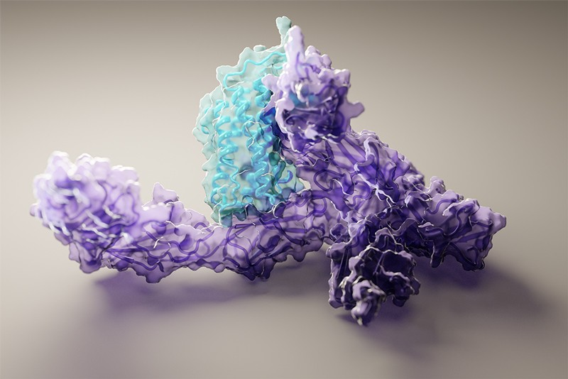

# A reference of 'AlphaFold2 Codec' include everything of AlphaFold2 as possible as I can.

------------------------------------------------------------------------------------------

# Learning Source Availability
## Papers
- [Jumper, J., Evans, R., Pritzel, A. et al. Highly accurate protein structure prediction with AlphaFold. Nature (2021). https://doi.org/10.1038/s41586-021-03819-2](https://www.nature.com/articles/s41586-021-03819-2)
  
## PPT 
- My Public talk on Alphafold2 Paper Reading By Xingqiang,Chen [.Key](https://github.com/chenxingqiang/ref-Alphafold-Code/blob/main/AF2-PPT/2021-07-30-AlphaFold2-paper-sharing-chen-xingqiang.key)/[.pptx](https://github.com/chenxingqiang/ref-Alphafold-Code/blob/main/AF2-PPT/2021-07-30-AlphaFold2-paper-sharing-chen-xingqiang.pptx)
in AF2-PPT file.
- Sergey Ovchinnikov talk on AF2 
[slides](https://docs.google.com/presentation/d/1mnffk23ev2QMDzGZ5w1skXEadTe54l8-Uei6ACce8eI/edit#slide=id.p) /[.pptx](https://github.com/chenxingqiang/ref-Alphafold-Code/blob/main/AF2-PPT/ColabFold.pptx) in AF2-PPT file.

## Learning by Code  
### Practice on Modeling Test of AF2
- https://github.com/sokrypton/ColabFold.git

## Blogs 
- [DeepMind: AlphaFold-Using-AI-for-scientific-discovery](https://deepmind.com/blog/article/AlphaFold-Using-AI-for-scientific-discovery)
- [DeepMind: alphafold-a-solution-to-a-50-year-old-grand-challenge-in-biology](https://deepmind.com/blog/article/alphafold-a-solution-to-a-50-year-old-grand-challenge-in-biology)
- [DeepMind: putting-the-power-of-alphafold-into-the-worlds-hands](https://deepmind.com/blog/article/putting-the-power-of-alphafold-into-the-worlds-hands)
# References 
## reference papers
- [Reference papers list](https://github.com/chenxingqiang/ref-Alphafold-Code/blob/main/AF2REFPAPERS.md) here and you can download them by [Baidu Cloud Driver Link](https://pan.baidu.com/s/131uRwemUTwGvY-6kqxCYDA) with the code 9w2p.
- [Reference Papers' Source Codes](https://github.com/chenxingqiang/ref-Alphafold-Code/tree/main/AF2-Ref-source-code) are included in this repo.

# Data availability
All input data are freely available from public sources.

Structures from the PDB were used for training and as templates (https://www.wwpdb.org/ftp/pdb-ftp-sites; for the associated sequence data and 40% sequence clustering see also https://ftp.wwpdb.org/pub/pdb/derived_data/ and https://cdn.rcsb.org/resources/sequence/clusters/bc-40.out).

 Training used a version of the PDB downloaded 28/08/2019, while CASP14 template search used a version downloaded 14/05/2020. Template search also used the PDB70 data- base, downloaded 13/05/2020 (https://wwwuser.gwdg.de/~compbiol/data/hhsuite/databases/hhsuite_dbs/).

We show experimental structures from the PDB with accessions
6Y4F76, 6YJ177, 6VR478, 6SK079, 6FES80, 6W6W81, 6T1Z82, and 7JTL83. 

For MSA lookup at both training and prediction time, 

we used UniRef90 v2020_01 (https://ftp.ebi.ac.uk/pub/databases/uniprot/previous_releases/release-2020_01/uniref/), 

BFD (https://bfd.mmseqs.com), Uniclust30 v2018_08 (https://wwwuser.gwdg.de/~compbiol/uniclust/2018_08/), 

and MGnify clusters v2018_12 (https://ftp.ebi.ac.uk/pub/databases/metagenomics/peptide_database/2018_12/). Uniclust30 v2018_08 was further used as input for constructing a distillation structure dataset.

# Code and programmings availability
### Source code
 for the AlphaFold model, trained weights, and an inference script is available under an open-source license at https://github.com/deepmind/alphafold. 

### Neural networks
 Neural networks were developed with 
- TensorFlow v1 (https://github.com/tensorflow/tensorflow), 
- Sonnet v1 (https://github.com/deepmind/sonnet),
- JAX v0.1.69 (https://github.com/google/jax/), 
- Haiku v0.0.4 (https://github.com/deepmind/dm-haiku).

### MSA search
For MSA search on 
- UniRef90, MGnify clusters, 
and reduced BFD we used jackhmmer and for template search on the PDB SEQRES we used 
- hmmsearch, both from HMMER v3.3 (http://eddylab.org/soft-ware/hmmer/).

For template search against PDB70, we used HHsearch from HH-suite v3.0-beta.3 14/07/2017 (https://github.com/soedinglab/hh-suite). 
For constrained relaxation of structures, we used OpenMM v7.3.1 (https://github.com/openmm/openmm) with the Amber99sb force field.

### Docking analysis
 Docking analysis on DGAT used 
 - P2Rank v2.1 (https://github.com/rdk/p2rank), 
 - MGLTools v1.5.6 (https://ccsb.scripps.edu/mgltools/) 
 - and AutoDockVina v1.1.2 (http://vina.scripps.edu/download/) on a workstation running Debian GNU/Linux rodete 5.10.40-1rodete1-amd64 x86_64.

### Data analysis 
Data analysis used 
- Python v3.6 (https://www.python.org/), 
- NumPy v1.16.4 (https://github.com/numpy/numpy), 
- SciPy v1.2.1 (https://www.scipy.org/), 
- seaborn v0.11.1 (https://github.com/mwaskom/seaborn), 
- scikit-learn v0.24.0 (https://github.com/scikit-learn/), 
- Matplotlib v3.3.4 (https://github.com/matplotlib/matplotlib), 
- pandas v1.1.5 (https://github.com/pandas-dev/pandas), 
- and Colab (https://research.google.com/colaboratory). 
- TM-align v20190822 (https://zhanglab.dcmb.med.umich.edu/TM-align) was used for computing TM-scores.

 ### Structure analysis  
 Structure analysis used Pymol v2.3.0 (https://github.com/schrodinger/pymol-open-source).

